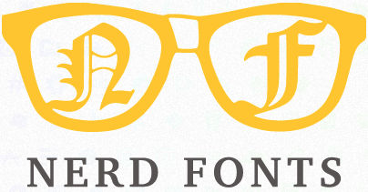

# TDTxLE_Font_flutter 

un paquete que reune las funetes como los icons de los fonts que mas me gusta para poder usarlos en **flutter**

actual mente solo cunetan con dos funetes las cuales son:

<br>


**Nerd Font:** 
el cual lo puedes encontar en [nerdfonts.com](https://www.nerdfonts.com). La fuente que actual mente se usa en este paquete es [*Hack Nerd Font*](https://github.com/ryanoasis/nerd-fonts/releases/download/v2.1.0/Hack.zip).

<br>

 

**BoxIcons:**
el cual lo puedes encontar en [boxicons.com](https://boxicons.com/).

## Use

### por tag
```yaml
tdtxle_fonts:
    git:
      url: https://github.com/LuisDeLaValie/tdtxle_fonts_flutter.git
      tag: 0.0.1
```
### por rama
```yaml
tdtxle_fonts:
    git:
      url: https://github.com/LuisDeLaValie/tdtxle_fonts_flutter.git
      ref: master        
```
### por commit
```yaml
tdtxle_fonts:
    git:
      url: https://github.com/LuisDeLaValie/tdtxle_fonts_flutter.git
      ref: f441cba
```
# ejemplo
```dart
import 'package:flutter/material.dart';
import 'package:tdtxle_fonts/tdtxle_fonts.dart';

void main() => runApp(MyApp());

class MyApp extends StatelessWidget {
  @override
  Widget build(BuildContext context) {
    return MaterialApp(
      title: 'Material App',
      home: Scaffold(
        appBar: AppBar(
          title: Text('Material App Bar'),
        ),
        body: const Center(
          child: Icon(IconsTDTxLE.nf_dev_git_branch),
        ),
      ),
    );
  }
}
```
